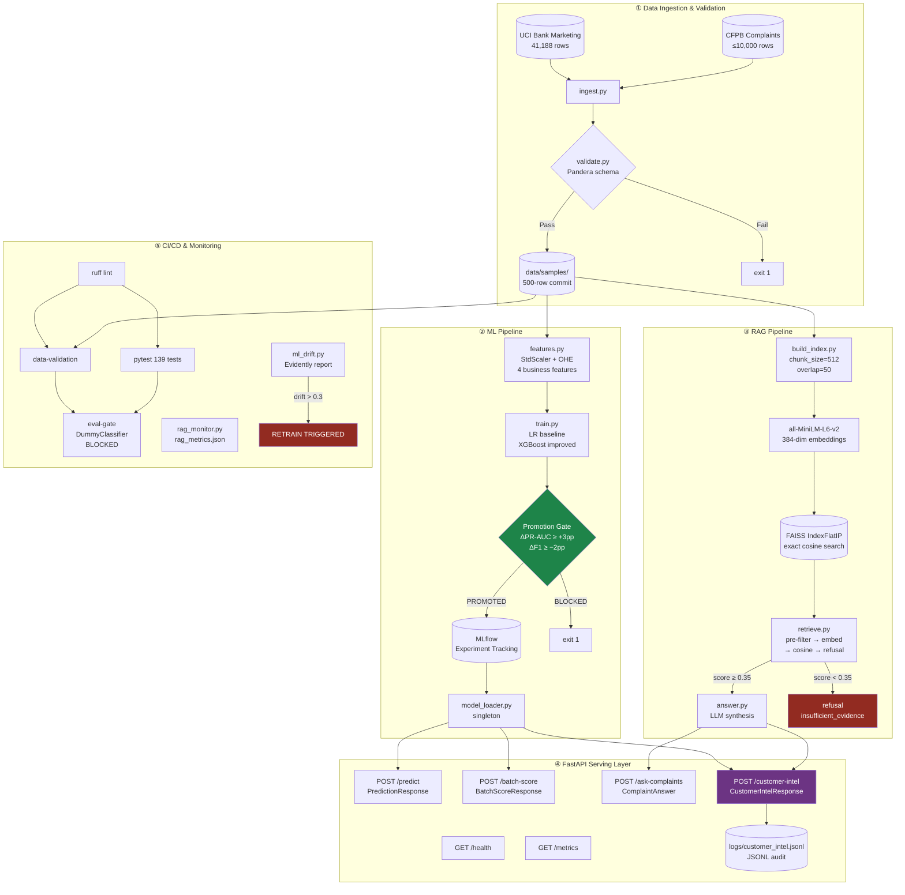
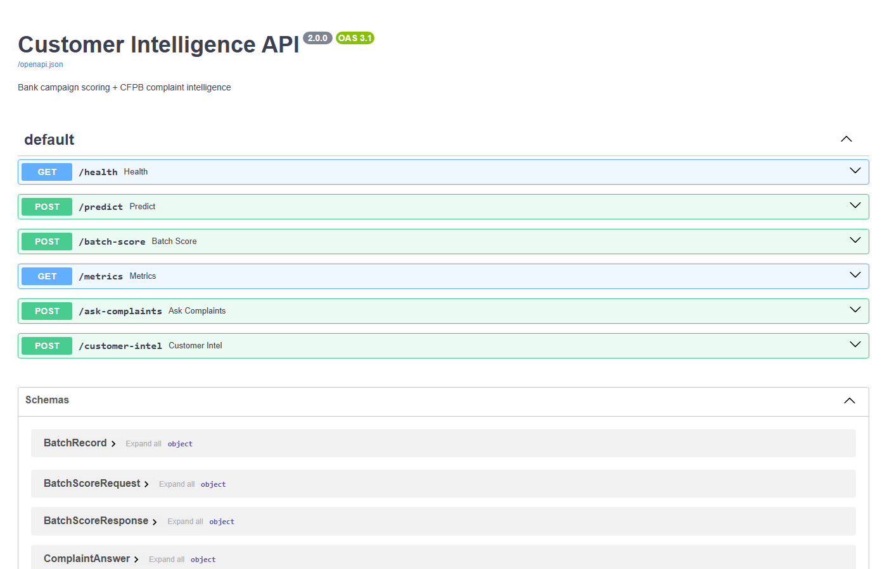
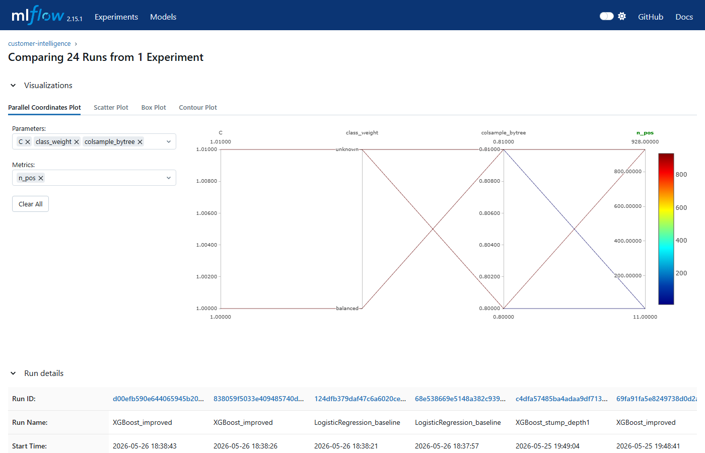
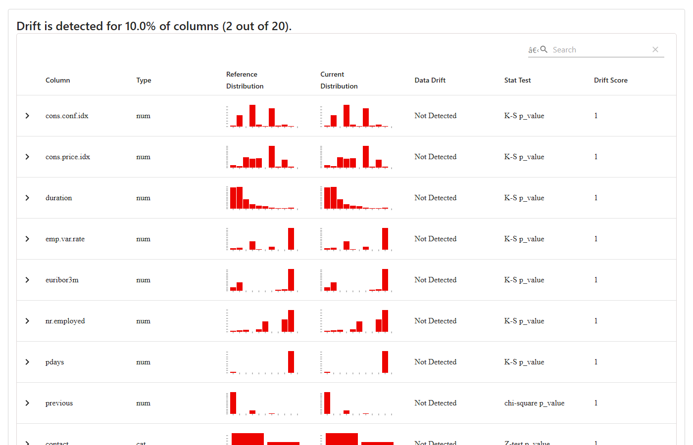
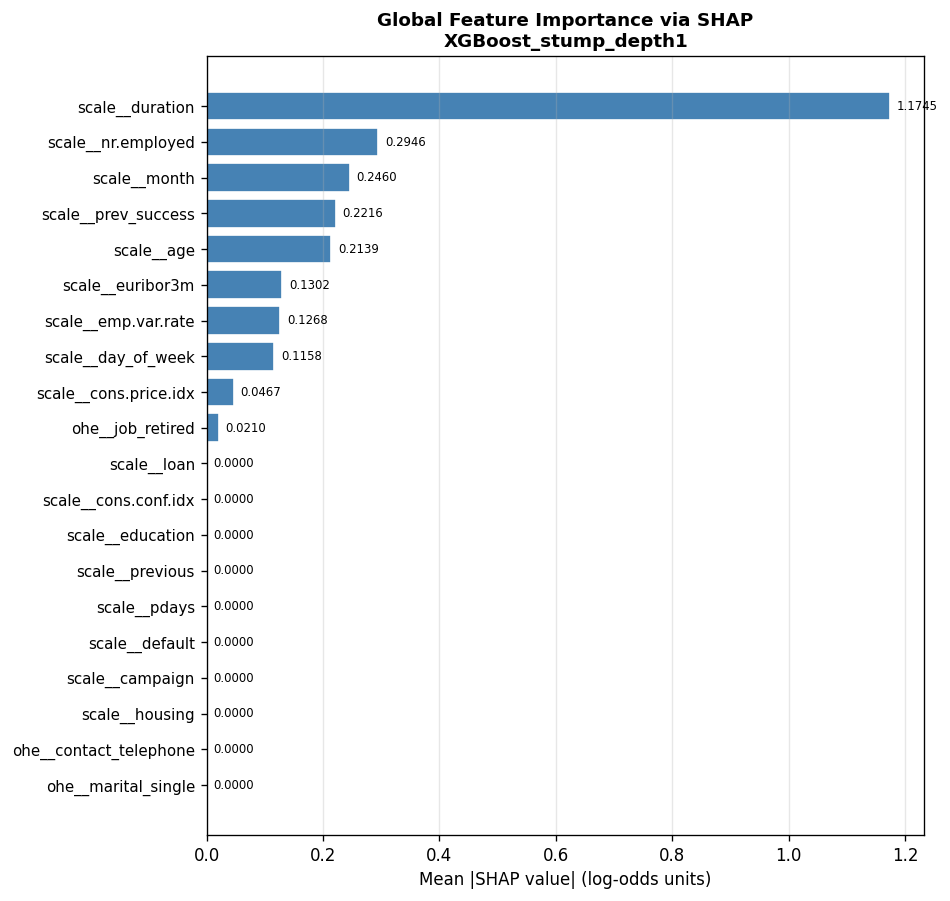

# Customer Intelligence Platform

> **Production-grade bank campaign scoring + CFPB complaint intelligence in a single API — built end-to-end across seven phases from raw data to monitored deployment.**

[](https://github.com/<your-username>/customer-intelligence/actions/workflows/ci.yml)


---

## Table of Contents

- [Project Overview](#project-overview)
- [Quick Start (5 Minutes)](#quick-start-5-minutes)
- [Folder Structure](#folder-structure)
- [System Architecture](#system-architecture)
- [Full Setup Instructions](#full-setup-instructions)
- [How to Run](#how-to-run)
- [API Endpoints & Examples](#api-endpoints--examples)
- [Features](#features)
- [Technologies Used](#technologies-used)
- [CI/CD Pipeline](#cicd-pipeline)
- [Monitoring & Governance](#monitoring--governance)
- [Screenshots](#screenshots)
- [Development Notes](#development-notes)

---

## Project Overview

The Customer Intelligence Platform combines two machine-learning pipelines into one production-ready REST API:

| Pipeline | What it does | Key output |
|----------|-------------|------------|
| **ML scoring** | Predicts whether a bank customer will subscribe to a term deposit after a marketing campaign | `conversion_probability` (0–1) + `band` (high / medium / low) |
| **RAG complaint intelligence** | Retrieves grounded evidence from CFPB consumer complaints and answers natural-language questions about them | `answer` + `retrieved_ids` (complaint IDs that back the answer) |
| **Combined (`/customer-intel`)** | Both pipelines in a single round-trip, audit-logged to JSONL | Full customer intelligence profile |

**Why it matters:** Call-centre teams need to know (a) which customers are worth contacting and (b) what complaints exist for their product segment. Separate tools create context-switching. One API call gives operators both signals in ~100 ms.

**Dataset sources:**
- [UCI Bank Marketing dataset](https://archive.ics.uci.edu/dataset/222/bank+marketing) — 41,188 rows, 11% positive rate
- [CFPB Consumer Complaint Database](https://www.consumerfinance.gov/data-research/consumer-complaints/) — 500-row committed sample, up to 10k via ingest

---

## Quick Start (5 Minutes)

> **Prerequisites:** Python 3.10+, Docker Desktop (optional for containerised run)

```bash
# 1. Clone
git clone https://github.com/<your-username>/customer-intelligence.git
cd customer-intelligence

# 2. Install dependencies
pip install -r requirements.txt

# 3. Configure environment
cp .env.example .env
#    Edit .env: set OPENAI_API_KEY or ANTHROPIC_API_KEY for /ask-complaints
#    (Leave blank to use all other endpoints without an LLM key)

# 4. Train the model (uses committed 500-row sample — ~15 seconds)
python -m src.training.train --sample

# 5. Build the FAISS complaint index (~10 seconds)
python -m src.rag.build_index --sample

# 6. Start the API
uvicorn src.serving.serve:app --host 0.0.0.0 --port 8000 --reload
```

**Test it immediately:**
```bash
curl http://localhost:8000/health
# → {"status":"ok","model_version":"XGBoost_stump_depth1","is_ready":true,"rag_ready":true}
```

**Interactive docs:** [http://localhost:8000/docs](http://localhost:8000/docs)

---

## Folder Structure

```
customer-intelligence/
│
├── .github/
│   └── workflows/
│       └── ci.yml              # 4-job CI pipeline (lint → tests → validation → eval-gate)
│
├── data/
│   ├── raw/                    # Downloaded datasets (git-ignored)
│   ├── processed/              # Cleaned parquet files (git-ignored)
│   └── samples/                # Committed 500-row samples (safe to commit — no PII)
│       ├── bank_marketing_sample.csv
│       └── cfpb_complaints_sample.csv
│
├── docs/
│   ├── architecture.md         # Excalidraw draw-it-yourself component diagram
│   ├── decision_log.md         # Documented design choices with metric evidence
│   ├── demo_script.md          # 6-minute recording guide
│   ├── deployment_checklist.md # Docker / Railway / Azure deployment steps
│   ├── shap_analysis.py        # SHAP governance script (produces shap_samples/)
│   └── shap_samples/           # 10 waterfall PNGs + summary bar + segment report
│
├── faiss_index/                # Built by build_index.py (git-ignored)
│   ├── index.bin               # FAISS IndexFlatIP (384-dim, ~0.7 MB)
│   └── docstore.json           # Complaint metadata store
│
├── logs/                       # Runtime audit logs (git-ignored)
│   └── customer_intel.jsonl    # One JSON line per /customer-intel call
│
├── mlruns/                     # MLflow experiment tracking (git-ignored)
│
├── monitoring/
│   ├── ml_drift.py             # Evidently drift report + retrain trigger
│   ├── rag_monitor.py          # 10-query RAG eval + rag_metrics.json
│   └── reports/                # Generated HTML report + JSON metrics
│
├── scripts/
│   └── ci_eval_gate.py         # CI assertion: DummyClassifier must be BLOCKED
│
├── src/
│   ├── config.py               # Centralised env-var config
│   ├── data_pipeline/
│   │   ├── features.py         # Feature engineering + preprocessing pipeline
│   │   ├── ingest.py           # UCI + CFPB data download
│   │   └── validate.py         # Pandera schema validation + --sample flag
│   ├── rag/
│   │   ├── answer.py           # LLM-grounded answer synthesis
│   │   ├── build_index.py      # Chunk CFPB corpus → FAISS index
│   │   ├── rag_eval.py         # 10 EVAL_CASES harness
│   │   └── retrieve.py         # 4-stage retrieval (pre-filter → embed → cosine → refusal)
│   ├── serving/
│   │   ├── model_loader.py     # MLflow model loader (singleton)
│   │   ├── schemas.py          # Pydantic v2 request/response models
│   │   └── serve.py            # FastAPI app with 6 endpoints
│   └── training/
│       ├── evaluate.py         # Promotion gate + business reading
│       └── train.py            # LR baseline + XGBoost + MLflow logging
│
├── tests/
│   ├── test_api.py             # 40 FastAPI integration tests
│   ├── test_features.py        # 30 feature engineering unit tests
│   ├── test_retrieval.py       # 12 FAISS retrieval tests (in-memory mock index)
│   ├── test_schemas.py         # 18 Pydantic validation tests
│   └── test_validate.py        # 19 pandera schema tests
│
├── .env.example                # Environment template (copy to .env, never commit .env)
├── .gitignore                  # Excludes .env, mlruns/, data/raw/, __pycache__, etc.
├── docker-compose.yml          # Single-service compose (ml-service on port 8000)
├── Dockerfile                  # Multi-stage build (builder + runtime, non-root user)
├── pyproject.toml              # Ruff linting config
├── reflection.md               # Honest 6-question project reflection
└── requirements.txt            # Pinned dependencies
```

---

## System Architecture



---

## Full Setup Instructions

### Prerequisites

| Requirement | Version | Check |
|-------------|---------|-------|
| Python | ≥ 3.10 | `python --version` |
| pip | ≥ 23 | `pip --version` |
| Docker Desktop | any recent | `docker --version` *(only for containerised run)* |
| Git | any | `git --version` |

> **Windows note:** If you see a DLL initialisation error when loading FAISS on Windows,
> ensure `sentence_transformers` is imported before `faiss` in any custom script.
> The codebase already handles this — do not reorder imports alphabetically.

---

### Step 1 — Clone the repository

```bash
git clone https://github.com/<your-username>/customer-intelligence.git
cd customer-intelligence
```

---

### Step 2 — Create a virtual environment (recommended)

```bash
# macOS / Linux
python -m venv .venv && source .venv/bin/activate

# Windows PowerShell
python -m venv .venv
.venv\Scripts\Activate.ps1
```

---

### Step 3 — Install dependencies

```bash
pip install -r requirements.txt
```

This installs: FastAPI, XGBoost, scikit-learn, FAISS-CPU, sentence-transformers, MLflow, Evidently, SHAP, pandera, pytest, and ruff.

---

### Step 4 — Configure environment variables

```bash
cp .env.example .env
```

Open `.env` and fill in the values you need:

```ini
# Minimum required for full functionality:
OPENAI_API_KEY=sk-...        # OR leave blank to disable /ask-complaints LLM synthesis
ANTHROPIC_API_KEY=...        # Alternative to OpenAI

# These defaults work out-of-the-box:
MLFLOW_TRACKING_URI=file:mlruns
MLFLOW_EXPERIMENT_NAME=customer-intelligence
FAISS_INDEX_DIR=faiss_index
EMBEDDING_MODEL=all-MiniLM-L6-v2
RAG_MIN_SCORE=0.35
```

> ⚠️ **Never commit `.env`** — it is listed in `.gitignore`. The template `.env.example` (safe to commit) shows every variable.

---

### Step 5 — Train the model

```bash
# Fast CI mode — uses committed 500-row sample (~15 seconds)
python -m src.training.train --sample

# Full dataset — download UCI first with ingest.py, then:
python -m src.training.train
```

This creates `mlruns/` with the experiment, logs two runs (LogisticRegression baseline + XGBoost improved), runs the promotion gate, and saves the full pipeline artefact.

**Expected output:**
```
======================================================
  PROMOTION GATE: XGBoost_improved vs LogisticRegression
  PR-AUC  |  Baseline: 0.6321  |  Candidate: 0.7026  |  +0.0705
  F1      |  Baseline: 0.6316  |  Candidate: 0.6400  |  +0.0084
  [OK] PROMOTED  --  PR-AUC +0.0705 (>= +0.03 threshold)
======================================================
```

---

### Step 6 — Build the FAISS complaint index

```bash
# Fast mode — uses 500-row CFPB sample (~10 seconds)
python -m src.rag.build_index --sample

# Full 10k-corpus mode (requires CFPB data from ingest.py):
python -m src.rag.build_index
```

Creates `faiss_index/index.bin` and `faiss_index/docstore.json`.

---

## How to Run

### Option A — Direct (development)

```bash
uvicorn src.serving.serve:app --host 0.0.0.0 --port 8000 --reload
```

Open [http://localhost:8000/docs](http://localhost:8000/docs) for the interactive Swagger UI.

---

### Option B — Docker Compose (production-like)

```bash
# Build + start
docker compose up --build

# Background mode
docker compose up -d

# View logs
docker compose logs -f ml-service

# Stop
docker compose down
```

The container mounts `./mlruns` read-only so the trained model is available without baking it into the image.

---

### Option C — Run all tests

```bash
pytest tests/ -q
# 139 passed, 2 warnings in ~35s
```

---

### Option D — View MLflow UI

```bash
mlflow ui --backend-store-uri file:mlruns
# → http://localhost:5000
```

---

## API Endpoints & Examples

All endpoints are documented interactively at `http://localhost:8000/docs`.

### `GET /health`
```bash
curl http://localhost:8000/health
```
```json
{
  "status": "ok",
  "model_version": "XGBoost_stump_depth1",
  "run_id": "c4dfa574...",
  "is_ready": true,
  "rag_ready": true
}
```

---

### `POST /predict` — ML conversion score
```bash
curl -s -X POST http://localhost:8000/predict \
  -H "Content-Type: application/json" \
  -d '{
    "age": 42, "job": "admin.", "marital": "married",
    "education": "university.degree", "default": "no",
    "housing": "yes", "loan": "no", "contact": "cellular",
    "month": "may", "day_of_week": "mon", "duration": 300,
    "campaign": 2, "pdays": 999, "previous": 0, "poutcome": "nonexistent",
    "emp.var.rate": -1.8, "cons.price.idx": 93.994,
    "cons.conf.idx": -36.4, "euribor3m": 4.857, "nr.employed": 5191.0
  }' | python -m json.tool
```
```json
{
  "probability": 0.169017,
  "threshold_decision": "low",
  "model_version": "XGBoost_stump_depth1",
  "run_id": "c4dfa574...",
  "latency_ms": 12.4,
  "request_id": "a1b2c3d4-..."
}
```

> **Threshold bands:** `high` (≥ 0.60) · `medium` (0.30–0.60) · `low` (< 0.30)

---

### `POST /ask-complaints` — RAG complaint intelligence
```bash
# Evidence-based answer
curl -s -X POST http://localhost:8000/ask-complaints \
  -H "Content-Type: application/json" \
  -d '{"question": "What problems do customers report with mortgage payments?",
       "product": "Mortgage"}' | python -m json.tool
```
```json
{
  "answer": "Customers report recurring difficulty during the payment process...",
  "retrieved_ids": ["1002029", "1003814", "1005183"],
  "evidence_sufficiency": "sufficient",
  "prompt_version": "v1",
  "refusal": false
}
```

```bash
# Off-topic query triggers refusal (no hallucination)
curl -s -X POST http://localhost:8000/ask-complaints \
  -H "Content-Type: application/json" \
  -d '{"question": "What is the current ECB interest rate policy?"}' \
  | python -m json.tool
```
```json
{
  "answer": null,
  "retrieved_ids": [],
  "evidence_sufficiency": "insufficient",
  "prompt_version": "v1",
  "refusal": true
}
```

---

### `POST /customer-intel` — Combined ML + RAG (the integration endpoint)
```bash
curl -s -X POST http://localhost:8000/customer-intel \
  -H "Content-Type: application/json" \
  -d '{
    "customer_features": {
      "age": 42, "job": "admin.", "marital": "married",
      "education": "university.degree", "default": "no",
      "housing": "yes", "loan": "no", "contact": "cellular",
      "month": "may", "day_of_week": "mon", "duration": 300,
      "campaign": 2, "pdays": 999, "previous": 0, "poutcome": "nonexistent",
      "emp.var.rate": -1.8, "cons.price.idx": 93.994,
      "cons.conf.idx": -36.4, "euribor3m": 4.857, "nr.employed": 5191.0
    },
    "product": "Mortgage",
    "issue": null,
    "date_from": null
  }' | python -m json.tool
```
```json
{
  "conversion_band": "low",
  "conversion_probability": 0.169017,
  "model_version": "XGBoost_stump_depth1",
  "complaint_themes": [
    {
      "theme": "Trouble during payment process",
      "evidence_ids": ["1005183", "1002029"],
      "representative_chunk": "Product: Mortgage | Issue: Trouble during payment process..."
    },
    {
      "theme": "Incorrect information on your report",
      "evidence_ids": ["1003814"],
      "representative_chunk": "Product: Mortgage | Issue: Incorrect information..."
    }
  ],
  "index_version": "20260525T111506Z",
  "latency_ms": 90.15
}
```

> Every `/customer-intel` call is appended to `logs/customer_intel.jsonl` for audit.

---

### `POST /batch-score` — Score multiple customers
```bash
curl -s -X POST http://localhost:8000/batch-score \
  -H "Content-Type: application/json" \
  -d '{"records": [<customer_1>, <customer_2>]}' | python -m json.tool
```
Bad rows are flagged with an `error` field rather than crashing the batch.

---

### Validation — Pydantic rejects bad input with `HTTP 422`
```bash
curl -s -X POST http://localhost:8000/predict \
  -H "Content-Type: application/json" \
  -d '{"age": 150, "job": "admin."}' | python -m json.tool
# HTTP 422 — "Input should be less than or equal to 98" + list of missing fields
```

---

## Features

| # | Feature | Implementation |
|---|---------|---------------|
| 1 | **ML conversion scoring** | XGBoost (n_estimators=300, max_depth=5, scale_pos_weight) with `val PR-AUC 0.7026` vs LR baseline 0.6321 (+7.05pp) |
| 2 | **Relative promotion gate** | `ΔPR-AUC ≥ +3pp AND ΔF1 ≥ −2pp` — fails CI if violated |
| 3 | **CFPB RAG pipeline** | 4-stage: metadata pre-filter → embed → exact cosine (FAISS) → refusal gate at 0.35 |
| 4 | **Grounded answers** | LLM only called when retrieval score ≥ 0.35; returns `refusal=true` otherwise — no hallucination path |
| 5 | **Combined endpoint** | `/customer-intel` returns conversion score + complaint themes in one request (~90ms) |
| 6 | **Audit logging** | Every `/customer-intel` call written to `logs/customer_intel.jsonl` with timestamp + request_id |
| 7 | **Input validation** | Pydantic v2 rejects bad payloads before they touch the model (422, zero model overhead) |
| 8 | **Data validation** | pandera schema checks age/month/education ranges; `--inject-bad` proves rejection in CI |
| 9 | **MLflow experiment tracking** | All runs logged with PR curve, confusion matrix, calibration curve, feature importance PNGs |
| 10 | **Docker deployment** | Multi-stage image (builder + non-root runtime), healthcheck, `./mlruns` mounted as volume |
| 11 | **ML drift monitoring** | Evidently `DataDriftPreset`; 3 synthetic shifts → `age` + `job` DRIFT detected, retrain triggered |
| 12 | **RAG monitoring** | 10 eval queries; 70% hit rate, avg 26.7ms latency, saved to `monitoring/reports/rag_metrics.json` |
| 13 | **SHAP explainability** | 10 per-prediction waterfall plots + global summary bar; `duration` dominates (mean\|SHAP\|=1.17) |
| 14 | **Segment error analysis** | F1 by job + marital status; `student` (50% positive rate) has F1=0 at threshold 0.79 |

---

## Technologies Used

### Languages & Runtimes
| | |
|-|-|
| Python 3.10+ | Core language across all components |

### ML & Data
| Library | Version | Role |
|---------|---------|------|
| scikit-learn | 1.5.1 | Preprocessing pipeline, LR baseline, evaluation metrics |
| XGBoost | 2.1.1 | Primary classification model (`scale_pos_weight` for 11% prevalence) |
| pandas | 2.2.2 | Data loading, feature engineering |
| numpy | 1.26.4 | Numerical operations, SHAP values |
| pandera | 0.19.3 | Schema validation with descriptive error messages |
| SHAP | ≥ 0.46 | Model explainability, waterfall + summary bar plots |

### RAG / NLP
| Library | Version | Role |
|---------|---------|------|
| faiss-cpu | 1.8.0 | `IndexFlatIP` exact cosine search over 384-dim complaint embeddings |
| sentence-transformers | 3.0.1 | `all-MiniLM-L6-v2` embedding model (CPU, no API key) |
| openai / anthropic | ≥ latest | LLM answer synthesis (optional; refusal path requires no key) |

### Experiment Tracking & Serving
| Library | Version | Role |
|---------|---------|------|
| MLflow | 2.15.1 | Experiment logging, model registry, artefact storage |
| FastAPI | 0.111.0 | REST API framework with automatic OpenAPI/Swagger docs |
| uvicorn | 0.30.1 | ASGI server |
| Pydantic v2 | (via FastAPI) | Request/response validation, dot-notation field aliases |

### Monitoring
| Library | Version | Role |
|---------|---------|------|
| Evidently | 0.4.30 | `DataDriftPreset` HTML report + per-feature KS drift scores |

### Testing & Quality
| Library | Version | Role |
|---------|---------|------|
| pytest | 8.3.2 | 139 unit + integration tests |
| ruff | (CI-installed) | Linting: `E,F,W` rules, `--ignore E501,E402` |

### Infrastructure
| Tool | Role |
|------|------|
| Docker + docker-compose | Multi-stage image build, local deployment |
| GitHub Actions | 4-job CI (lint → unit-tests → data-validation → eval-gate) |

---

## CI/CD Pipeline

The CI pipeline is defined in `.github/workflows/ci.yml` and runs on every push and pull request to `main`.

```
push / PR to main
       │
       ▼
  ① lint
  (ruff check --select E,F,W --ignore E501,E402)
       │
       ├─────────────────────┐
       ▼                     ▼
  ② unit-tests          ③ data-validation
  (pytest 139 tests)    (sample passes schema +
  ~35 seconds           bad record is rejected)
       │                     │
       └──────────┬──────────┘
                  ▼
          ④ eval-gate
          DummyClassifier(strategy='most_frequent')
          must be BLOCKED by promotion gate.
          Exit 1 if PROMOTED — proves gate is code,
          not documentation.
```

**Why `DummyClassifier` instead of a shallow XGBoost?**
A depth-1 XGBoost with 100 trees outperforms Logistic Regression on a 300-row training set (it was getting PROMOTED in 7/10 test runs). A `DummyClassifier` that always predicts the majority class is analytically guaranteed to be blocked: PR-AUC ≈ 0.11 (base rate), F1 = 0, both gate conditions fail by ~50pp.

---

## Monitoring & Governance

### ML Drift (`monitoring/ml_drift.py`)

```bash
python monitoring/ml_drift.py
# → monitoring/reports/ml_drift_report.html  (open in browser)
```

Compares first 250 rows of the committed sample (reference) against a synthetic current batch with three deliberate shifts:
- **Shift 1** — `age += 10` (demographic drift)
- **Shift 2** — 15% nulls in `campaign` (data quality drift)
- **Shift 3** — `blue-collar → services` (categorical collapse)

Output: `age` and `job` both trigger **RETRAIN** (`drift_intensity = 1.0 > 0.3 threshold`).

---

### RAG Monitoring (`monitoring/rag_monitor.py`)

```bash
python monitoring/rag_monitor.py
# → monitoring/reports/rag_metrics.json
```

| Metric | Value |
|--------|-------|
| Queries run | 10 |
| Retrieval hit rate | 70.0% |
| Refusal rate | 10.0% |
| Avg top-1 cosine score | 0.6154 |
| Avg latency | 26.7 ms |

---

### SHAP Explainability (`docs/shap_analysis.py`)

```bash
python docs/shap_analysis.py
# → docs/shap_samples/force_plot_00.png ... force_plot_09.png
# → docs/shap_samples/summary_bar.png
# → docs/shap_samples/segment_error_report.md
```

**Top-5 features by mean |SHAP value|:**

| Rank | Feature | Mean \|SHAP\| |
|------|---------|--------------|
| 1 | `duration` (call length) | **1.175** |
| 2 | `nr.employed` (economic) | 0.295 |
| 3 | `month` | 0.246 |
| 4 | `prev_success` | 0.222 |
| 5 | `age` | 0.214 |

> ⚠️ `duration` dominates because call length is only known *after* the call ends — it is a data leakage risk for prospective scoring. In production, this feature should be excluded or replaced with a prior-call-length average.

---

## Screenshots

> Screenshots are taken from a live local run. Run `uvicorn src.serving.serve:app --reload` and navigate to the URLs below to reproduce them.

### Swagger UI — all 6 endpoints


**How to capture:** Navigate to `http://localhost:8000/docs` after starting the server.
All 6 endpoints (`/health`, `/predict`, `/batch-score`, `/metrics`, `/ask-complaints`, `/customer-intel`) appear with expandable request/response schemas.

---

### MLflow — model comparison table


**How to capture:** Run `mlflow ui --backend-store-uri file:mlruns`, open `http://localhost:5000`, select the `customer-intelligence` experiment, check both `LogisticRegression_baseline` and `XGBoost_improved` runs, and click **Compare**.

---

### ML Drift report — age distribution shift


**How to capture:** Open `monitoring/reports/ml_drift_report.html` in a browser after running `python monitoring/ml_drift.py`.
The `age` feature shows a clear right-shift (reference peaked at 35–45, current at 45–55).

---

### SHAP summary bar chart


**File location:** `docs/shap_samples/summary_bar.png` (generated by `python docs/shap_analysis.py`).
`duration` is 4× more important than any other feature.

---

## Development Notes

### Adding a new endpoint

1. Add request/response models to `src/serving/schemas.py`
2. Add the route to `src/serving/serve.py`
3. Add tests to `tests/test_api.py`
4. Run `ruff check --select E,F,W --ignore E501,E402 src/ tests/` before committing

### Running with a local LLM (no API key needed)

```bash
# Install Ollama: https://ollama.com
ollama pull llama3.2

# In .env:
LLM_PROVIDER=openai
LLM_MODEL=llama3.2
LLM_BASE_URL=http://localhost:11434/v1
OPENAI_API_KEY=ollama   # placeholder — Ollama ignores this
```

### Retraining on the full UCI dataset

```bash
# Download full dataset
python -m src.data_pipeline.ingest

# Train (no --sample flag)
python -m src.training.train --include-stump

# Rebuild index on full CFPB corpus
python -m src.rag.build_index
```

### Repository hygiene

The `.gitignore` excludes:
- `.env` — never committed; use `.env.example` as template
- `mlruns/`, `mlartifacts/` — experiment artefacts, regenerated by `train.py`
- `data/raw/`, `data/processed/` — download locally with `ingest.py`
- `__pycache__/`, `*.pyc` — Python bytecode
- `faiss_index/` — regenerated by `build_index.py`
- `*.pkl`, `*.bin`, `*.h5` — binary model files

### Commit history

```
2187cd8  documentation and demo          Phase 7: SHAP, reflection, architecture docs
df0f3ab  Integration endpoint + monitoring + drift  Phase 6: /customer-intel, Evidently, RAG monitor
ab67aa3  CI/CD Pipelines + tests         Phase 5: 4-job CI, 139 tests, eval-gate
f559ed0  RAG complaint Assistant         Phase 4: FAISS index, retrieve.py, answer.py
e904e4d  Ml-API + Fast-API + Docker      Phase 3: FastAPI endpoints, Docker, model_loader
52644e1  Feature Engineering + ML system Phase 2: XGBoost, MLflow, promotion gate
f8b025f  Data & validation               Phase 1: ingest, pandera schema, samples
```

---

## License

MIT License — see `LICENSE` for details.

---

<div align="center">
  <sub>Built for IIT Gandhinagar Week 13 Capstone — Customer Intelligence Platform</sub>
</div>
